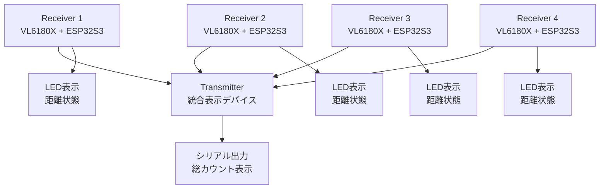
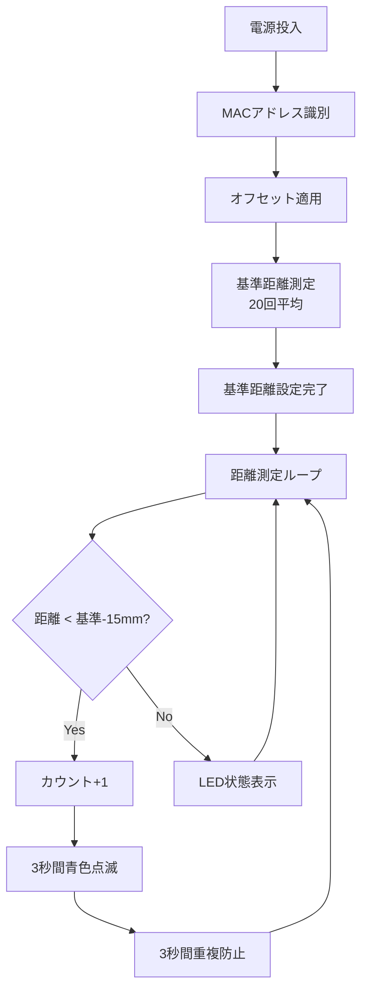
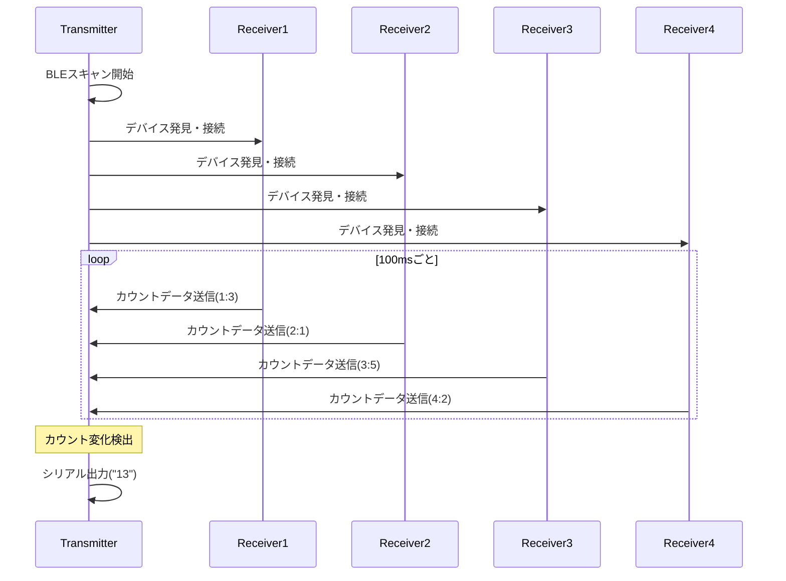
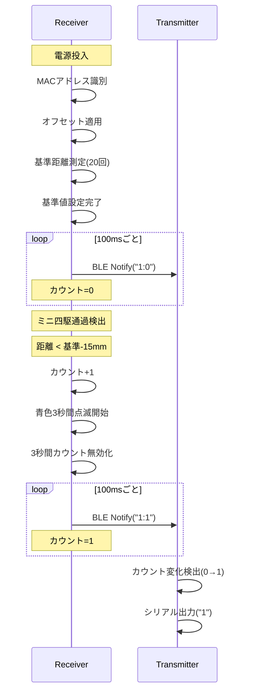

# Yonku Counter 2

ESP32S3ベースのミニ四駆通過カウンターシステム。VL6180X ToFセンサーとBLE通信を使用した分散型カウンターシステム

## 概要

このプロジェクトは、4台の個別センサーデバイス（Receiver）と1台の統合表示デバイス（Transmitter）で構成されるミニ四駆通過カウンターシステムです。各センサーデバイスがVL6180X ToFセンサーでミニ四駆の通過を検出し、BLEで統合表示デバイスにカウントデータを送信します。

## システム構成



## プロジェクト構成

### ビルド環境

このプロジェクトは3つのビルド環境を提供します：

| 環境名 | 説明 | 用途 |
|--------|------|------|
| `main` | 元の単体センサープログラム | 開発・テスト用 |
| `receiver` | 個別センサーデバイス | 4台のカウンター側 |
| `transmitter` | 統合表示デバイス | カウント集計・表示 |

### ビルドコマンド

```bash
# 全環境ビルド
pio run

# 個別環境ビルド
pio run -e receiver      # レシーバー用
pio run -e transmitter   # トランスミッター用
pio run -e main         # メイン用（開発・テスト）

# アップロード
pio run -e receiver --target upload
pio run -e transmitter --target upload
```

## ハードウェア仕様

### 共通ハードウェア
- **マイコン**: Seeed Studio XIAO ESP32S3
- **開発環境**: PlatformIO + Arduino Framework
- **デバイス識別**: MACアドレスベース自動識別

### Receiver（個別センサー）
- **センサー**: Adafruit VL6180X ToF距離センサー
- **通信**: I2C（センサー）、BLE（データ送信）
- **LED**: 赤色・青色LED（PWM制御、D0/D1ピン）
- **電源**: USB-C
- **校正**: デバイス個別オフセット値対応

### Transmitter（統合表示）
- **通信**: BLE（データ受信）
- **表示**: シリアル出力
- **LED**: 内蔵LED（受信表示、21ピン）
- **接続管理**: 最大4台同時接続、自動再接続

## 機能仕様

### Receiver（個別センサー）の機能

#### 1. デバイス自動識別とキャリブレーション
電源投入時にMACアドレスでデバイスを自動識別し、個別設定を適用：
- **識別方式**: MACアドレス照合
- **対応デバイス**: 4台（デバイス1-4）
- **個別オフセット**: デバイスごとの距離補正値適用
- **未登録デバイス**: デフォルト設定で動作継続

#### 2. 基準距離自動設定
電源投入時に自動的にレーン距離を測定し、基準値を設定：
- **測定回数**: 20回
- **基準値**: 平均距離
- **検出閾値**: 基準値 - 15mm（固定）
- **再校正**: シリアルで 'c' コマンド送信

#### 3. ミニ四駆通過検出とカウント



#### 4. BLE通信（常時送信）
- **サービスUUID**: `4fafc201-1fb5-459e-8fcc-c5c9c331914b`
- **キャラクタリスティックUUID**: `beb5483e-36e1-4688-b7f5-ea07361b26a8`
- **デバイス名**: `YonkuCounter_1` ～ `YonkuCounter_4`
- **送信データ**: `"デバイス番号:カウント値"` (例: `"1:5"`)
- **送信頻度**: 100msごと（取りこぼし防止）
- **送信パワー**: 最大出力（+9dBm）で安定接続

#### 5. LED状態表示
| 状態 | LED色・パターン | 説明 |
|------|-----------------|------|
| カウントアップ | 青色3秒間点滅 | 検出・カウント実行後 |
| 検出中 | 赤色点灯 | 基準-15mm以下検出中 |
| 通常待機 | 青色微弱（100） | 待機状態 |
| BLE送信中 | 青色短時間点灯 | 50ms間青色最大光度 |
| センサーエラー | 赤色点滅（250ms間隔） | センサー読み取りエラー |
| センサーなし | 青色明滅（1秒間隔） | センサー未接続時 |
| 起動時 | 青色3回点滅 → 青色2回点滅 | 初期化完了表示 |

### Transmitter（統合表示）の機能

#### 1. BLEデバイススキャン・接続



#### 2. カウント変化検出と出力
- **監視対象**: 各デバイスのカウント値
- **検出方式**: 前回値との比較
- **チェック頻度**: 50msごと
- **出力形式**: 変化したレーン番号の連結（例: "1", "14", "234"）
- **出力タイミング**: カウント変化検出時のみ

#### 3. シリアル出力仕様
| 変化パターン | 出力例 | 説明 |
|-------------|-------|------|
| 1レーンのみ | `1` | デバイス1のカウントが変化 |
| 1,4レーン | `14` | デバイス1,4のカウントが同時変化 |
| 全レーン | `1234` | 全デバイスのカウントが変化 |

#### 4. 接続状態管理
- **再接続**: 10秒ごとの接続チェック
- **リトライ**: 自動再スキャン・再接続
- **ステータス**: 30秒ごとの詳細状態表示（接続状況・カウント値）
- **LED表示**: 受信時100ms間内蔵LED点灯

## 通信プロトコル

### BLE通信フロー



## LED状態表示

### Receiver LED パターン

| 状態 | LED色・パターン | PWM値 | 説明 |
|------|-----------------|-------|------|
| カウントアップ | 青色3秒間点滅（250ms間隔） | 青255/0切替 | 検出・カウント実行後 |
| 検出中 | 赤色点灯 | 赤255 | 基準-15mm以下検出中 |
| 通常待機 | 青色微弱 | 青100 | 待機状態 |
| BLE送信中 | 青色短時間最大光度 | 青255→100 | 50ms間点灯後通常に戻る |
| センサーエラー | 赤色点滅（250ms間隔） | 赤255/0切替 | センサー読み取りエラー |
| センサーなし | 青色明滅（1秒間隔） | 青200/50切替 | センサー未接続時 |
| 起動時 | 青色3回→2回点滅 | 青100 | 初期化→セットアップ完了 |

### Transmitter LED パターン

| 状態 | LED色・パターン | 説明 |
|------|-----------------|------|
| 起動時 | 3回点滅（200ms間隔） | 初期化完了 |
| データ受信時 | 100ms間点灯 | カウント変化受信時 |
| 通常時 | 消灯 | 待機状態 |

## セットアップ手順

### 1. 環境構築
```bash
# PlatformIOインストール後
git clone <repository>
cd yonku_counter2
```

### 2. デバイス設定の確認・変更
`src/receiver.cpp` 内のデバイス設定配列を確認：
```cpp
DeviceCalibration devices[] = {
  {"cc:ba:97:15:4d:0c", 1, "デバイス1", 125},  // MACアドレス, 番号, 名前, オフセット
  {"cc:ba:97:15:53:20", 2, "デバイス2", 55},
  {"cc:ba:97:15:4f:28", 3, "デバイス3", -5},
  {"cc:ba:97:15:37:34", 4, "デバイス4", 0}
};
```

### 3. Receiverデバイスのセットアップ
```bash
# 4台のデバイスそれぞれに書き込み
pio run -e receiver --target upload

# 各デバイスのMACアドレス確認（シリアルモニター）
pio device monitor
```

### 4. Transmitterデバイスのセットアップ
```bash
# 統合表示デバイスに書き込み
pio run -e transmitter --target upload
```

### 5. 動作確認
1. Transmitterデバイスを起動
2. Receiverデバイスを順次起動
3. シリアルモニターで接続状況を確認
4. 各センサーで通過テストを実行
5. 必要に応じて 'c' コマンドで再校正

## トラブルシューティング

### センサー初期化失敗
- **症状**: VL6180X初期化エラー
- **対処**: I2C接続・電源供給を確認
- **備考**: センサーなしモードで動作継続可能

### BLE接続失敗
- **症状**: Transmitterでデバイスが見つからない
- **対処**: 
  - デバイス名の重複確認
  - 距離制限（約10m以内）の確認
  - 再スキャン・再接続の自動実行を待つ
  - Receiverデバイスの再起動

### MACアドレス未登録デバイス
- **症状**: "未登録のデバイス" メッセージ
- **対処**: 
  1. シリアルモニターでMACアドレス確認
  2. `devices[]` 配列に追加
  3. プログラム再書き込み

### 基準距離校正
- **症状**: 検出感度が適切でない
- **対処**:
  ```bash
  # シリアルモニターで 'c' コマンド送信
  # レーンクリア状態で再校正実行
  ```

### LED表示異常
- **症状**: LED点灯パターンが正常でない
- **対処**: 
  - PWMピン（D0/D1）の接続確認
  - LED極性の確認

## 開発・カスタマイズ

### デバイス追加・変更
1. **MACアドレス登録**:
   ```cpp
   DeviceCalibration devices[] = {
     {"新しいMACアドレス", 5, "デバイス5", オフセット値},
     // ...
   };
   ```
2. **Transmitterの接続数上限変更**: 配列サイズ調整
3. **LED表示パターン追加**: PWM値・点滅パターンの調整

### パラメータ調整
- **検出閾値**: `DETECTION_THRESHOLD` (現在15mm)
- **重複検出時間**: `COUNT_IGNORE_DURATION` (現在3000ms)
- **BLE送信頻度**: 現在100ms間隔
- **LED強度・パターン**: `setLEDIntensity()` 関数内

### 個別オフセット校正
各デバイスの距離測定特性に応じてオフセット値を調整：
- 正の値: 測定距離を短く補正
- 負の値: 測定距離を長く補正
- 0: 補正なし

## ライセンス

このプロジェクトは開発用途で作成されています。商用利用時は関連ライブラリのライセンスを確認してください。

## 技術仕様詳細

### BLE通信プロトコル
- **プロトコル**: BLE 4.0+
- **送信パワー**: ESP_PWR_LVL_P9 (+9dBm最大出力)
- **スキャン設定**: Interval 1349, Window 449, ActiveScan有効
- **接続管理**: 自動再接続、10秒間隔での状態チェック
- **データ形式**: ASCII文字列 "デバイス番号:カウント値"

### センサー仕様
- **測定範囲**: VL6180X仕様に依存（最大200mm程度）
- **測定精度**: ±3mm（典型値）
- **I2Cクロック**: 100kHz（安定性重視）
- **測定モード**: 単発測定（連続測定なし）

### システム要件
- **同時接続**: 最大4台のReceiverデバイス
- **通信距離**: 約10m（BLE範囲内）
- **電源**: USB-C 5V（各デバイス独立）
- **動作環境**: 室内推奨（外部光の影響軽減）

## 依存ライブラリ

- **Adafruit VL6180X Library**: ToFセンサー制御
- **Adafruit BusIO**: I2C通信サポート
- **ESP32 BLE Arduino**: BLE通信機能
- **WiFi**: MACアドレス取得専用（通信には未使用）
- **Wire**: I2C通信インターフェース

## 使用例とベストプラクティス

### 推奨セットアップ手順
1. **事前準備**:
   - 4台のXIAO ESP32S3を用意
   - VL6180XセンサーをI2C接続（3台分）
   - 各デバイスのMACアドレスを事前確認

2. **初回セットアップ**:
   ```bash
   # 1台目（Transmitter）をセットアップ
   pio run -e transmitter --target upload
   
   # 2-4台目（Receiver）を順次セットアップ
   pio run -e receiver --target upload
   ```

3. **校正作業**:
   - 各Receiverで基準距離の自動校正を確認
   - 必要に応じて 'c' コマンドで再校正
   - センサー設置位置の最適化

### 運用時の注意点
- **センサー配置**: 直射日光や反射の影響を避ける
- **電源管理**: USB電源の安定供給を確保
- **距離設定**: レーン幅に応じた基準距離の確認
- **定期メンテナンス**: センサーレンズの清掃

## 既知の制限事項

### ハードウェア制限
- **測定距離**: VL6180Xの最大測定距離（約200mm）
- **環境光影響**: 強い外部光源での測定精度低下
- **I2C制限**: 1台のESP32につき1個のVL6180X推奨

### ソフトウェア制限
- **同時接続数**: BLE接続は最大4台まで
- **検出感度**: 固定閾値（15mm）での判定
- **重複防止**: 3秒間の固定待機時間

### 通信制限
- **BLE距離**: 約10m範囲内での動作
- **データ遅延**: BLE通信特性による若干の遅延
- **接続安定性**: 電波環境に依存